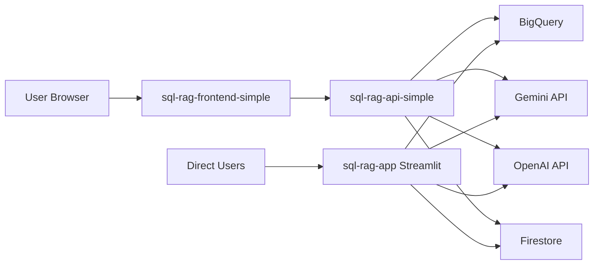

# Multi-Service Deployment Guide

Complete guide for deploying all three services (Streamlit, FastAPI, React) from a single codebase using Google Cloud Run.

## Architecture Overview

This repository contains **THREE separate applications** that deploy as independent Cloud Run services:

| Service | Technology | Deploy Script | Buildpack/Dockerfile | Port |
|---------|-----------|---------------|---------------------|------|
| **sql-rag-app** | Streamlit | `deploy_cloudbuild.sh` | Dockerfile | 8080 |
| **sql-rag-api-simple** | FastAPI | `deploy_api_simple.sh` | Python buildpack | 8080 |
| **sql-rag-frontend-simple** | React/Vite | `deploy_frontend_simple.sh` | Node.js buildpack | varies |

## Quick Start

### 1. Prerequisites

```bash
# Install Google Cloud CLI
gcloud --version

# Authenticate
gcloud auth login
gcloud config set project YOUR_PROJECT_ID

# Set up API keys in .env.deploy
cp .env.deploy.example .env.deploy
# Edit .env.deploy with your actual keys
```

### 2. Deploy All Services

```bash
cd rag_app

# Deploy Streamlit UI (existing workflow)
./deploy_cloudbuild.sh

# Deploy FastAPI backend (new simple workflow)
./deploy_api_simple.sh

# Deploy React frontend (new simple workflow)
./deploy_frontend_simple.sh
```

### 3. Access Your Services

After deployment, you'll have three independent URLs:

```
Streamlit UI:  https://sql-rag-app-xxxxx.run.app
FastAPI API:   https://sql-rag-api-simple-xxxxx.run.app
React Frontend: https://sql-rag-frontend-simple-xxxxx.run.app
```

## Detailed Deployment Guide

### Service 1: Streamlit UI (Existing)

**File:** `deploy_cloudbuild.sh`
**Method:** Dockerfile + Cloud Build
**Status:** ✅ Already working

This is your existing Streamlit deployment. No changes needed.

```bash
./deploy_cloudbuild.sh --service-name sql-rag-app
```

**What it deploys:**
- Full Streamlit application (`app_simple_gemini.py`)
- All dependencies including both Streamlit and FastAPI
- Uses Secret Manager for API keys
- Runs on port 8080

### Service 2: FastAPI Backend (NEW)

**File:** `deploy_api_simple.sh`
**Method:** Python buildpacks (no Dockerfile)
**Status:** 🆕 New simple deployment

This deploys ONLY the FastAPI backend using Google's buildpack approach.

```bash
./deploy_api_simple.sh
```

**How it works:**
1. Loads API keys from `.env.deploy`
2. Temporarily swaps `requirements.txt` with `requirements.api.txt` (no Streamlit)
3. Deploys using buildpacks
4. Restores original `requirements.txt`

**Why the swap?**
- `requirements.txt` has both Streamlit AND FastAPI
- Buildpack auto-detection gets confused
- `requirements.api.txt` has ONLY FastAPI dependencies
- Clean separation during deployment

**What gets deployed:**
- FastAPI application (`api/main.py`)
- All shared modules (`services/`, `data/`, `core/`)
- API keys as environment variables (MVP approach)
- PYTHONPATH set to `/app` to resolve imports

**Access:**
```bash
# API Documentation
https://sql-rag-api-simple-xxxxx.run.app/docs

# Health check
https://sql-rag-api-simple-xxxxx.run.app/health

# Example endpoint
https://sql-rag-api-simple-xxxxx.run.app/query/search
```

### Service 3: React Frontend (NEW)

**File:** `deploy_frontend_simple.sh`
**Method:** Node.js buildpacks (no Dockerfile)
**Status:** 🆕 New simple deployment

This deploys the React/Vite frontend as a static site.

```bash
./deploy_frontend_simple.sh
```

**How it works:**
1. Changes to `frontend/` directory
2. Deploys using Node.js buildpacks
3. Buildpack runs `npm install` and `npm run build`
4. Serves built files from `dist/` using `serve` package
5. Auto-detects backend URL from `sql-rag-api-simple`

**Custom backend URL:**
```bash
BACKEND_URL=https://custom-api-url.run.app ./deploy_frontend_simple.sh
```

**What gets deployed:**
- Built React application (Vite production build)
- Static assets from `dist/` directory
- Nginx-style serving via `serve` package
- Lightweight (512Mi memory, 1 CPU)

## Key Files Explained

### For Backend Deployment

| File | Purpose |
|------|---------|
| `requirements.api.txt` | FastAPI-only dependencies (no Streamlit) |
| `deploy_api_simple.sh` | Deployment script for API |
| `Procfile` | Tells buildpack to run uvicorn |
| `.env.deploy` | API keys for deployment (git-ignored) |

### For Frontend Deployment

| File | Purpose |
|------|---------|
| `frontend/Procfile` | Tells buildpack to serve built files |
| `frontend/package.json` | Includes `serve` dependency |
| `deploy_frontend_simple.sh` | Deployment script for frontend |

## The Buildpack Detection Problem (SOLVED)

### Problem
When deploying from `rag_app/` directory:
- `requirements.txt` contains BOTH `streamlit` and `fastapi`
- Python buildpack detects Streamlit first
- Tries to run `app_simple_gemini.py` instead of `api/main.py`
- Results in `ModuleNotFoundError: No module named 'data'`

### Solution
**Temporary requirements swap during API deployment:**

1. Backup: `cp requirements.txt requirements.txt.backup`
2. Swap: `cp requirements.api.txt requirements.txt`
3. Deploy with buildpacks (now only sees FastAPI)
4. Restore: `mv requirements.txt.backup requirements.txt`

This ensures buildpack sees ONLY FastAPI dependencies during API deployment.

## Environment Variables

### Backend (FastAPI)

```bash
PYTHONUNBUFFERED=1
PYTHONPATH=/app                          # Critical for module imports
EMBEDDINGS_PROVIDER=openai
BIGQUERY_PROJECT_ID=your-project-id
BIGQUERY_DATASET=bigquery-public-data.thelook_ecommerce
CORS_ORIGINS=*                           # Update with frontend URL later
OPENAI_API_KEY=sk-...
GEMINI_API_KEY=AIza...
```

### Frontend (React)

```bash
VITE_API_BASE_URL=https://sql-rag-api-simple-xxxxx.run.app
```

## Updating CORS After Deployment

After deploying both backend and frontend, update CORS:

```bash
# Get frontend URL
FRONTEND_URL=$(gcloud run services describe sql-rag-frontend-simple --region us-central1 --format='value(status.url)')

# Update backend CORS
gcloud run services update sql-rag-api-simple \
  --region us-central1 \
  --update-env-vars "CORS_ORIGINS=$FRONTEND_URL"
```

## Troubleshooting

### Backend: "ModuleNotFoundError: No module named 'data'"

**Cause:** PYTHONPATH not set correctly or wrong app starting

**Fix:** Check deployment logs for which app is starting:
```bash
gcloud run services logs read sql-rag-api-simple --region us-central1 --limit 50
```

Should see:
```
Starting uvicorn with: api.main:app
```

NOT:
```
Starting streamlit run app_simple_gemini.py
```

### Backend: Still deploying Streamlit

**Cause:** requirements.txt swap didn't work or buildpack cached

**Fix:**
```bash
# Force rebuild by adding --no-cache
# (Note: Not directly supported, but can delete old revisions)
gcloud run services delete sql-rag-api-simple --region us-central1
./deploy_api_simple.sh
```

### Frontend: Blank page

**Cause:** API URL not configured or CORS blocking requests

**Solution:**
1. Check browser console for errors
2. Verify `VITE_API_BASE_URL` is set during build
3. Update backend CORS as shown above

### Frontend: Module build errors

**Cause:** `node_modules` not installed or `serve` missing

**Solution:**
```bash
cd frontend
npm install
npm run build  # Test locally first
cd ..
./deploy_frontend_simple.sh
```

## Cost Estimates

| Service | Memory | CPU | Traffic | Monthly Cost |
|---------|--------|-----|---------|--------------|
| Streamlit | 2Gi | 2 | Light | ~$5-10 |
| FastAPI | 2Gi | 2 | Light | ~$5-10 |
| Frontend | 512Mi | 1 | Light | ~$2-5 |
| **Total** | | | | **~$12-25/month** |

With `min-instances=0`, you only pay during active requests.

## Service Dependencies



## Migration Path

### Current State (Before)
- ✅ Streamlit app deployed with Dockerfile
- ❌ No FastAPI deployment
- ❌ No React frontend deployment

### Target State (After)
- ✅ Streamlit app (unchanged - still uses Dockerfile)
- ✅ FastAPI backend (new - buildpacks)
- ✅ React frontend (new - buildpacks)

### Safe Migration Steps

1. **Keep Streamlit working:**
   ```bash
   # Don't touch this - it works
   ./deploy_cloudbuild.sh
   ```

2. **Deploy FastAPI backend:**
   ```bash
   # New deployment, won't affect Streamlit
   ./deploy_api_simple.sh
   ```

3. **Deploy React frontend:**
   ```bash
   # New deployment, won't affect anything
   ./deploy_frontend_simple.sh
   ```

4. **Update CORS:**
   ```bash
   # Connect frontend to backend
   # (See "Updating CORS" section above)
   ```

5. **Test all three:**
   - Streamlit: Original URL still works
   - FastAPI: New API URL with `/docs`
   - React: New frontend URL

## Cleanup

To remove services you don't need:

```bash
# Delete Streamlit UI
gcloud run services delete sql-rag-app --region us-central1

# Delete FastAPI backend
gcloud run services delete sql-rag-api-simple --region us-central1

# Delete React frontend
gcloud run services delete sql-rag-frontend-simple --region us-central1
```

## Next Steps

### For Production

1. **Use Secret Manager instead of env vars:**
   ```bash
   # Create secrets
   echo "sk-..." | gcloud secrets create openai-api-key --data-file=-

   # Deploy with secrets
   gcloud run services update sql-rag-api-simple \
     --update-secrets "OPENAI_API_KEY=openai-api-key:latest"
   ```

2. **Add authentication:**
   ```bash
   gcloud run services update sql-rag-api-simple --no-allow-unauthenticated
   ```

3. **Restrict CORS:**
   ```bash
   # Instead of CORS_ORIGINS=*
   --update-env-vars "CORS_ORIGINS=https://your-frontend-domain.com"
   ```

4. **Set up custom domains:**
   ```bash
   gcloud run domain-mappings create --service sql-rag-frontend-simple --domain app.yourdomain.com
   ```

## Support

**View Logs:**
```bash
# Backend
gcloud run services logs tail sql-rag-api-simple --region us-central1

# Frontend
gcloud run services logs tail sql-rag-frontend-simple --region us-central1

# Streamlit
gcloud run services logs tail sql-rag-app --region us-central1
```

**Service Status:**
```bash
# List all services
gcloud run services list --region us-central1

# Get service details
gcloud run services describe sql-rag-api-simple --region us-central1
```

---

**Questions?** Check the main `DEPLOYMENT_SIMPLE.md` for more details on the buildpack approach.
